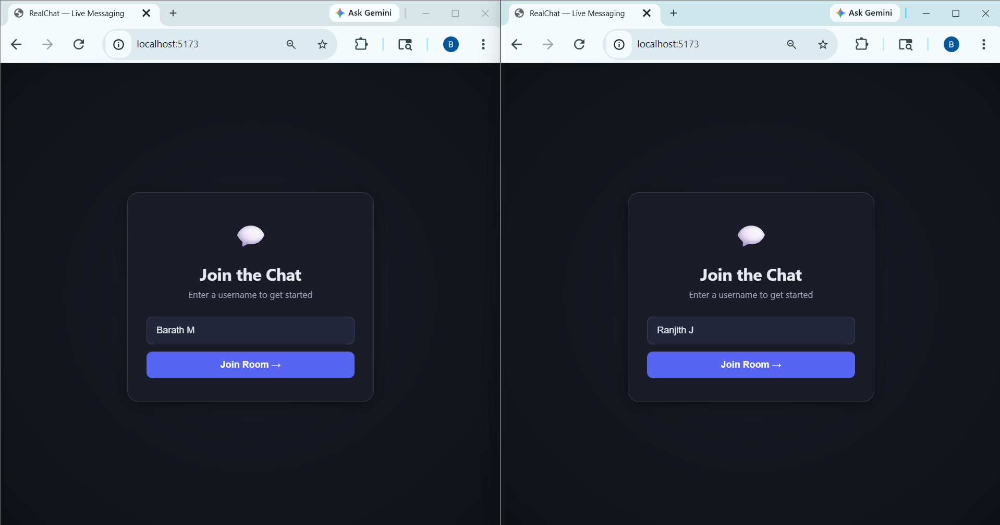
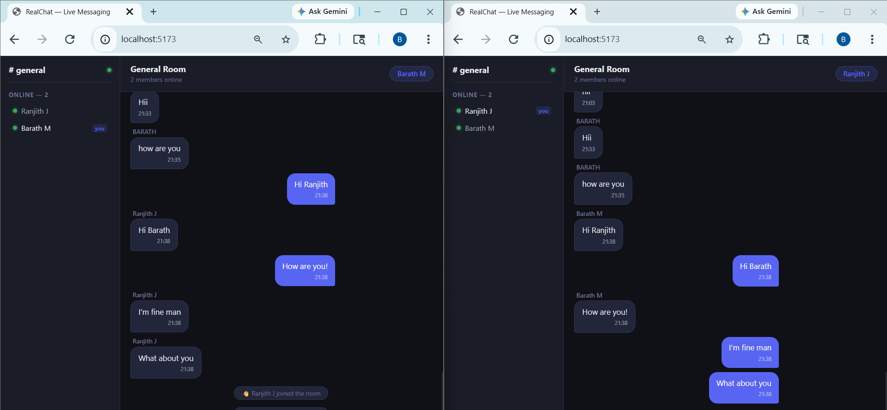
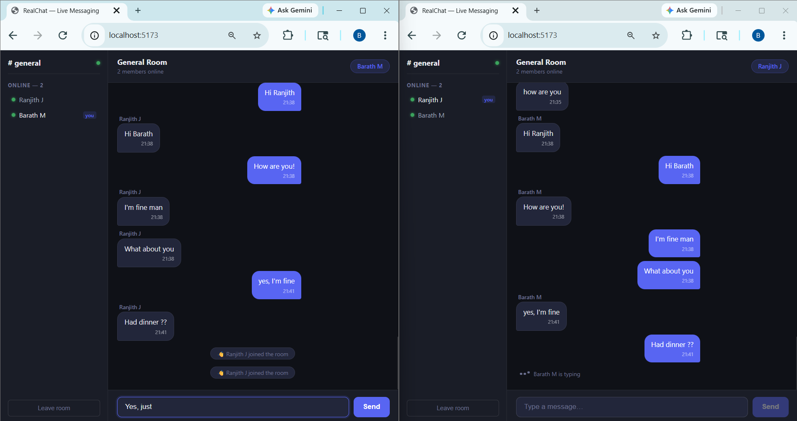
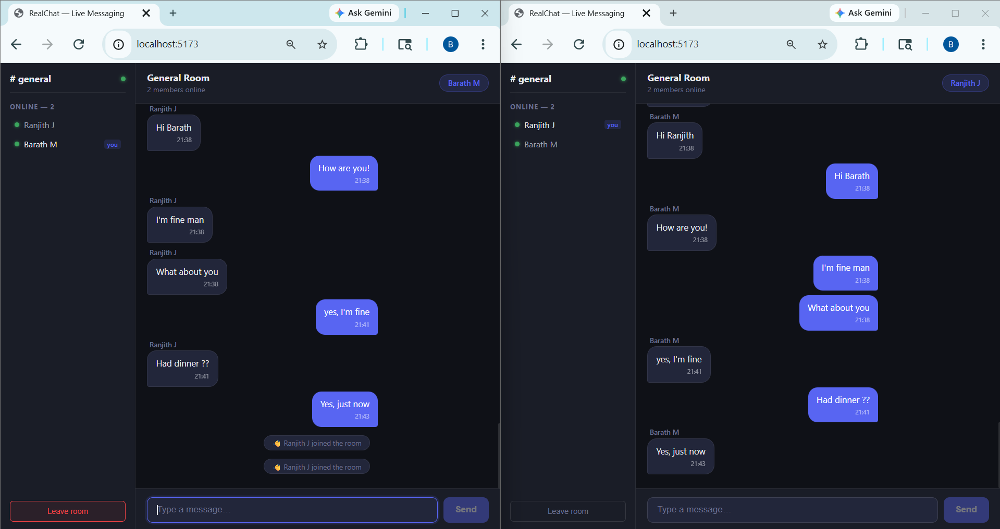
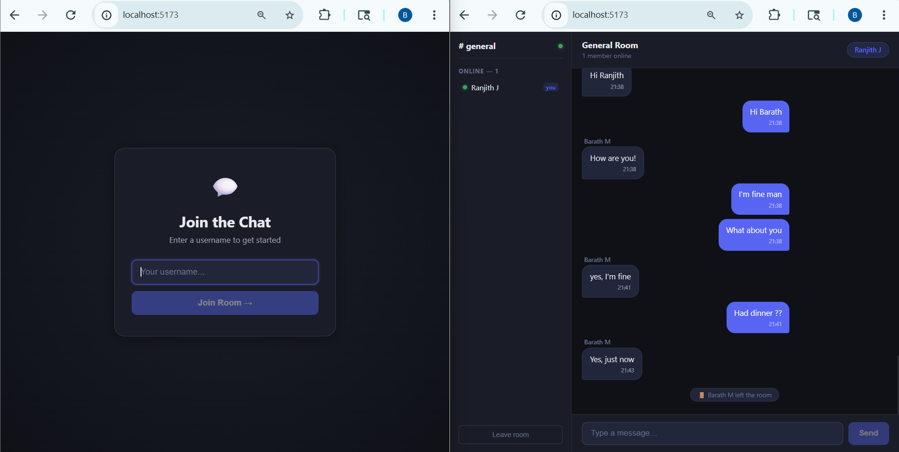

# RealChat

A real-time chat app built with React, Node.js, Socket.io, and MongoDB. Open two browser tabs and watch messages appear instantly.

## Screenshots

| Login Screen | Two Users Chatting |
|---|---|
|  |  |

| Typing Indicator | Message History |
|---|---|
|  |  |



## What's Inside

- Real-time messaging with WebSockets
- Live user list showing who's online
- Typing indicators
- Message history loaded from MongoDB on join
- Auto-reconnect when connection drops

## Tech Stack

Frontend: React 18, Vite, Socket.io-client  
Backend: Node.js, Express, Socket.io  
Database: MongoDB with Mongoose

## Prerequisites

You'll need these installed:

- Node.js v18 or higher
- npm (comes with Node)
- MongoDB v6 or higher
- Git

Quick check:
```bash
node --version
npm --version
mongod --version
```

## Getting Started

### 1. Clone the repo

```bash
git clone https://github.com/YOUR_USERNAME/realtime-chat.git
cd realtime-chat
```

Replace `YOUR_USERNAME` with your actual GitHub username.

### 2. Start MongoDB

**Mac (Homebrew):**
```bash
brew services start mongodb-community
```

**Ubuntu/Debian:**
```bash
sudo systemctl start mongod
```

**Windows (run CMD as Administrator):**
```bash
net start MongoDB
```

Verify it's running:
```bash
mongosh
```

You should see the MongoDB shell. Type `exit` to quit. The app creates a database called `realtime-chat` automatically on first run.

### 3. Set up the backend

**Mac/Linux:**
```bash
cd server
cp .env.example .env
npm install
npm run dev
```

**Windows:**
```bash
cd server
copy .env.example .env
npm install
npm run dev
```

You should see:
```
MongoDB connected: localhost
Server running on http://localhost:5000
```

### 4. Set up the frontend

Open a second terminal:

**Mac/Linux:**
```bash
cd client
cp .env.example .env
npm install
npm run dev
```

**Windows:**
```bash
cd client
copy .env.example .env
npm install
npm run dev
```

You should see:
```
Local: http://localhost:5173/
```

### 5. Try it out

1. Open `http://localhost:5173` in your browser
2. Enter a username and join
3. Open a second tab at the same URL
4. Enter a different username
5. Start chatting — messages appear in both tabs instantly

## Project Structure

```
realtime-chat/
├── screenshots/
│   ├── login.png
│   ├── chat-realtime.png
│   ├── typing.png
│   ├── history.png
│   └── leave.png
├── server/
│   ├── src/
│   │   ├── config/db.js
│   │   ├── models/Message.js
│   │   ├── controllers/messageController.js
│   │   ├── routes/messageRoutes.js
│   │   ├── socket/socketHandler.js
│   │   └── index.js
│   └── package.json
│
└── client/
    ├── src/
    │   ├── context/SocketContext.jsx
    │   ├── hooks/useSocket.js
    │   ├── components/
    │   │   ├── Chat/
    │   │   ├── UI/
    │   │   └── Join/
    │   ├── pages/ChatPage.jsx
    │   └── App.jsx
    └── package.json
```

## Socket Events

**Client sends:**
- `join_room` — user enters the chat
- `send_message` — user sends a message
- `typing` — user starts typing
- `stop_typing` — user stops typing

**Server sends:**
- `receive_message` — new message broadcast to room
- `room_users` — current online user list
- `user_joined` — someone joined notification
- `user_left` — someone left notification
- `typing` / `stop_typing` — typing indicators

## API Endpoints

- `GET /api/messages?room=general&limit=50` — fetch message history
- `GET /api/health` — health check

## Environment Variables

**server/.env**
```
PORT=5000
MONGODB_URI=mongodb://localhost:27017/realtime-chat
CLIENT_URL=http://localhost:5173
NODE_ENV=development
```

**client/.env**
```
VITE_SERVER_URL=http://localhost:5000
```

## Troubleshooting

**Can't connect to MongoDB**  
Make sure MongoDB is running. On Linux: `sudo systemctl status mongod`. On Mac: `brew services list`. On Windows: run `net start MongoDB` in an Administrator CMD. Default connection is `mongodb://localhost:27017`.

**Socket connection fails in browser**  
Check the backend is up on port 5000 first: `curl http://localhost:5000/api/health` should return `{"status":"ok"}`. Also make sure `CLIENT_URL` in `server/.env` exactly matches your Vite dev server URL.

**Port already in use**  
Change `PORT` in `server/.env` to something like `5001`, then update `VITE_SERVER_URL` in `client/.env` to match.

**Messages not saving after refresh**  
MongoDB isn't running. Real-time messaging still works since Socket.io doesn't need the database, but messages won't survive a page refresh.

## Building for Production

```bash
cd client && npm run build
cd ../server && NODE_ENV=production node src/index.js
```

Built frontend goes into `client/dist/`. Serve it from Express by adding this to `server/src/index.js`:
```js
app.use(express.static(path.join(__dirname, '../../client/dist')))
```

## License

MIT
